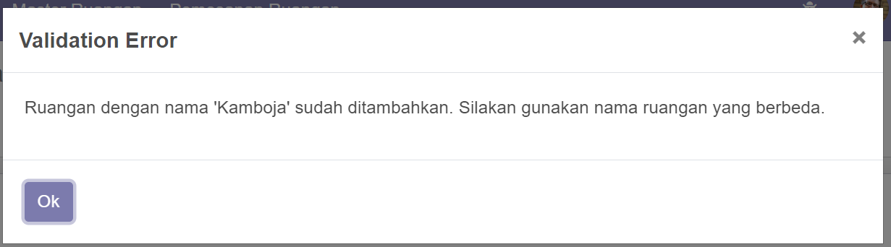
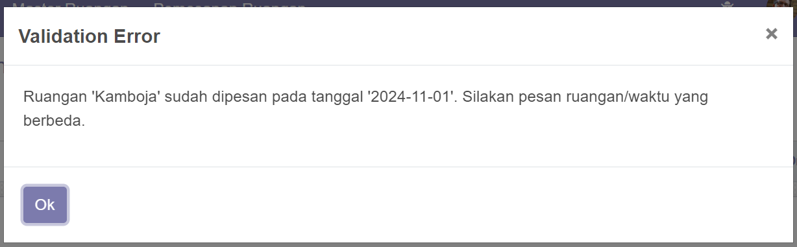

# Technical Assessment 2
Repository ini merupakan jawaban dari Technical Assessment 2

## Requirements used
OS windows
Python 3.10.11
pip 23.0.1
Postgresql 15

## Installation
1. Move to the directory where you would like to perform the installation
2. run command: "git clone https://www.github.com/odoo/odoo --depth 1 --branch 14.0 --single-branch odoo14" (clone base odoo 14)
3. run command: "git clone https://github.com/friliansa/technical_assessment_2 custom_addons" (clone this repo for custom_addons)
4. run command: "python -m venv odoo14_venv" (create virtual env)
5. run command: "odoo14_venv\Scripts\activate" (activate virtual env)
6. run command: "python -m pip install --upgrade pip" (install pip)
7. run command: "pip install -r odoo14\requirements.txt" (install requirement odoo 14 from odoo repo, Please check the manually installed requirements against the requirements listed in odoo14/requirements.txt)
8. run command: "python odoo14\odoo-bin -c custom_addons/odoo14.conf -u all" (init running odoo)
9. open Apps menu in odoo and search 'room_booking'
   
10. The module is installed successfully
11. Now, You can add record

## Features
1. Admin can add access for users to add/edit/delete in the Room Master and Room Booking modules.
2. Admin can add access for users to the process/finish button in the Room Booking module.
3. Room names in the Room Master cannot be duplicated.
   
4. Booking names in the Room Booking cannot be duplicated because use a sequence.
5. A room that is booked cannot be booked by another customer.
   

## Result
1. Master Ruangan
   
   
2. Pemesanan
   

